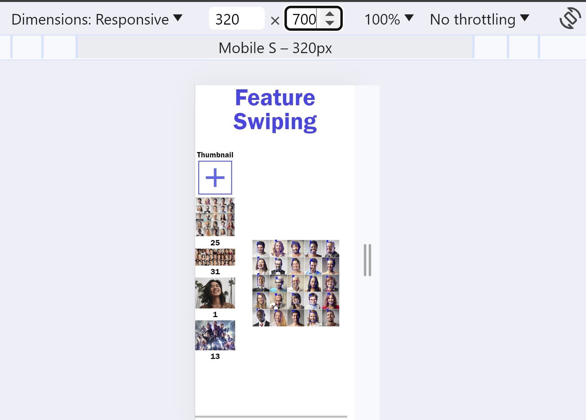
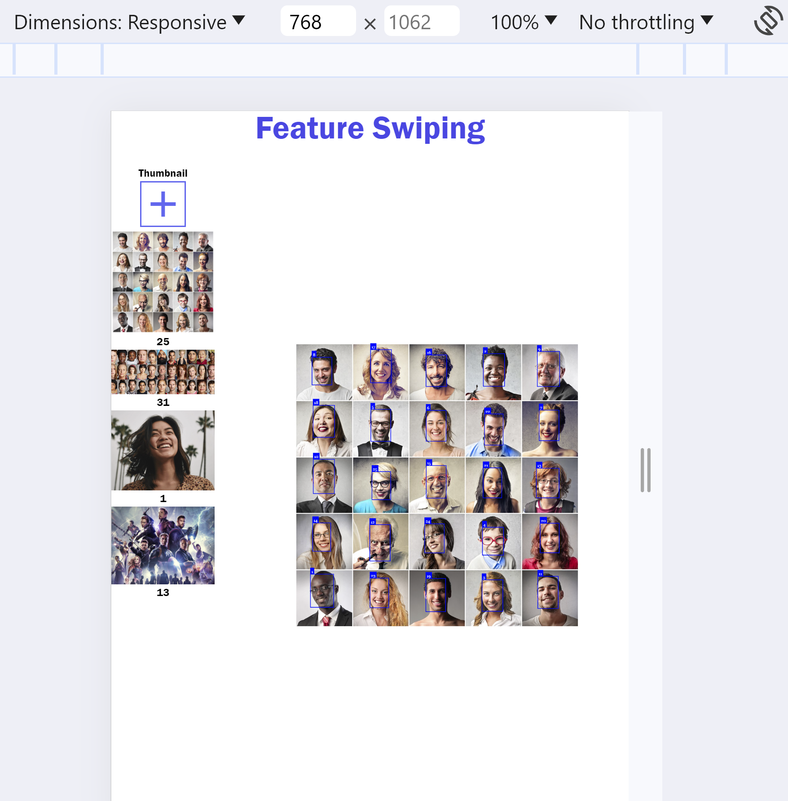

*Feature Swiping Onboarding Doc

`docker-compose up` 
- Will build the image and navigate to localhost:3000 to see the project

**Responsive Design
- Feature swiping exists in three dimensions desktop, tablet and mobile

