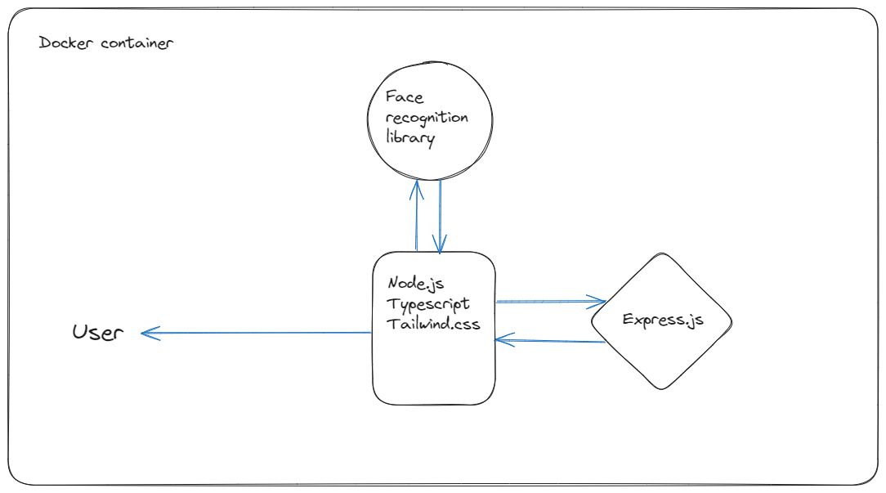

# Feature Swiping Onboarding Doc

Facial recognition application is a tool that detectes faces in uploaded images against a model that recognized human features from trained datasets. 

### `docker-compose up` 
- Will build the image and navigate to localhost:3000 to see the project

## Responsive Design
- Feature swiping exists in three dimensions desktop, tablet and mobile

Image1. Desktop

Image2. Tablet

Image3. Mobile

## Navigation Tips
Please find available images to upload and visualize under ./client/data